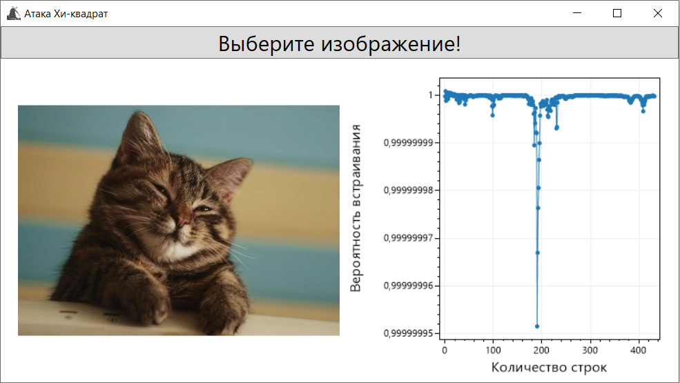

# Steganalysis based on Chi-squared

This C# solution implements the method of statistical steganalysis based on Chi-square statistics analysis, also known as "Chi-square Attack".

## Brief description of the method
The essence of the method is that if the bits used to rewrite the low-order bits are equally distributed, the frequencies of both values of each pair (PoV, Pair of Values) 0011010**0** and 0011010**1** become equal.

Since the embedding function overwrites the lower bits, it does not change the sum of these two frequencies. The count taken from the odd value frequency is transferred to the corresponding even value frequency in each PoV, and vice versa. As the sum stays constant, the arithmetic mean is the same for a PoV in both, the original carrier medium and each corresponding steganogram. This fact allows us to obtain the theoretically expected frequency distribution from the random sample. 

The degree of similarity of the observed sample distribution and the theoretically expected frequency distribution is a measure of the probability that some embedding has taken place. The degree of similarity is determined using the Chi-square test.

The image is analyzed line by line, increasing the analyzed area by one line for each step in the cycle.

**NOTE**: Original article: ["Attacks on Steganographic Systems. Breaking the Steganographic Utilities EzStego, Jsteg, Steganos, and S-Tools and Some Lessons Learned"](https://web.archive.org/web/20151123010933/http://users.ece.cmu.edu/~adrian/487-s06/westfeld-pfitzmann-ihw99.pdf)

## Libraries used
ScottPlot.WPF Version: 4.1.69